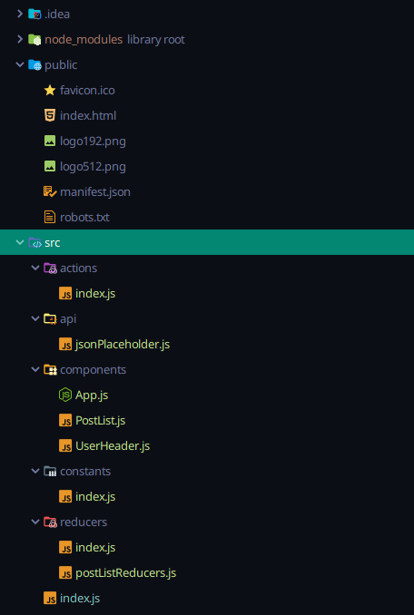

##Dependencies:
* @material-ui/core: ^4.9.5,
* @material-ui/icons: ^4.9.1,
* @material-ui/styles: ^4.9.0,
* axios: ^0.19.2,
* react: ^16.13.0,
* react-dom: ^16.13.0,
* react-redux: ^7.2.0,
* react-scripts: 3.4.0,
* redux: ^4.0.5,
* redux-thunk: ^2.3.0
##Build process:
* Installed packages (refer to dependencies list)
* Setup initial directory structure:

* Created dummy reducer in reducers/index.js 
```$xslt
import { combineReducers } from "redux";
export default combineReducers({
    foo: () => { return 'foo' }
})
``` 
* Created store and connected middleware in index.js:
```$xslt
import React from "react";
import ReactDOM from 'react-dom';
import thunk from 'redux-thunk';
import { Provider } from 'react-redux';
import { createStore, applyMiddleware } from 'redux';
import App from "./components/App";
import reducers from "./reducers/index";
const store = createStore(reducers, applyMiddleware(thunk));
ReactDOM.render( 
    <Provider store={store}>
        <App />
    </Provider>,
    document.querySelector('#root'));
```
* React components:
    * App 
    * Header
    * SearchBar
    * SearchFilter
    * PokemonList
    * Details
* Styling with css modules and Material-UI components
* Redux setup for fetching pokemon data:
   * Defined action constants in constants/index.js
   
  ```
  export const postRequestTypes = {
      FETCH_POSTS_REQUEST: 'FETCH_POSTS_REQUEST',
      FETCH_POSTS_FAILURE: 'FETCH_POSTS_FAILURE',
      FETCH_POSTS_SUCCESS: 'FETCH_POSTS_SUCCESS',
  };
  ```
  * Action creators:
    * In actions/index.js, the redux-thunk middleware is being used to call an asynchronous API. 
    * A function is returned in each of the action creators. That function uses the dispatch method as an argument. That dispatch function is then called as an inner function, and passed it's own argument -- the action object. 
  * Reducers:
    * Reducer could be referenced directly, but used combineReducers(), in case additional reducers were added.
    * pokemonListReducer is updating the store with the results returned from the API request.
    * This data is referenced in other components where reducers' initial state is mapped to props and used to render the search results/list elements.
    
#### Room for improvement:
With more time, I think the main thing I would have gone back and edited is the SearchFilters component -- specifically the values of state used to control input (filter checkboxes) and pass data for query to the SearchBar parent component. The properties of 'type' and 'weakness' in state could have been initialized as an object with key/val pairs denoting the filter name and bool indicating selection. Instead, I've got an array here for each state property. Within the array of objects, each object contains a single property denoting a filter option. This was still effective for allowing me to map all the data and update state on input changes. However, I think the code could look a little cleaner if I were to have used an object for each state, and mapped out each filter through something like a 'for each' loop on each filter property of the object.

In completing the bonus, and was able to do the following:
* Create a Details page
* provide a button to details page from master list; 
* Provide a back button to return to list page.

If I had more time, however, I would have added an additional link to the details page of the other pokemon being refereing in the prev_evolution and next_evolution stats. The logic is there, and the changes needed to render this correctly are referred to in the TODO comments.